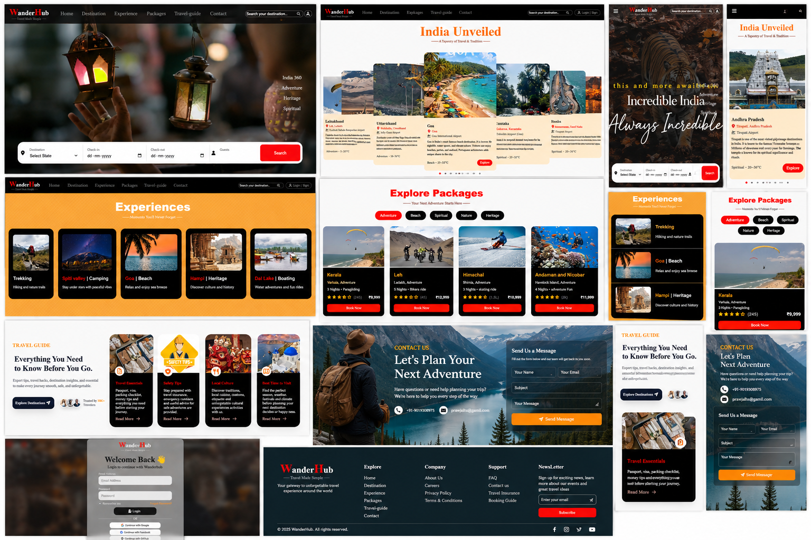

# ✈️ WanderHub – Travel & Tourism Website

> Explore. Dream. Discover.

WanderHub is a modern, responsive travel and tourism website designed to help travelers discover destinations, explore experiences, and plan their next adventure.

The project focuses on creating a professional travel experience with a clean UI, responsive layouts, interactive components, travel guides, destination search, contact forms, and authentication UI.

---

## 🌍 Live Demo

🔗 **Live Website:**  
https://sud-debug66.github.io/wanderhub-travel-website/

🔗 **GitHub Repository:**  
https://github.com/Sud-deBUG66/wanderhub-travel-website

---

## 📸 Project Preview




---

## ✨ Features

### 🏠 Home Page
- Modern travel landing page
- Attractive hero section
- Destination search interface
- Check-in and check-out fields
- Guest selection
- Call-to-action buttons
- Responsive navigation

### 🔐 Login Modal
- Responsive login interface
- Email and password fields
- Remember me option
- Forgot password option
- Google login UI
- Facebook login UI
- GitHub login UI
- Create account option

### 📍 Destinations
- Browse famous travel destinations
- Destination cards with images and descriptions
- Filter and explore locations
- Responsive grid layout

### 🌄 Experiences
- Adventure activities and unique travel experiences
- Cultural tours and local attractions
- Outdoor adventures and sightseeing
- Beautiful image gallery

### 🎒 Packages
- Domestic and international travel packages
- Package details including duration, pricing, and itinerary
- Easy-to-read travel cards
- Responsive package section

### 🧭 Travel Guide
- Travel essentials
- Safety tips
- Local culture information
- Best time to visit
- Interactive guide cards
- Traveller trust section

### 📩 Contact Section
- Contact information
- Name and email fields
- Subject field
- Message textarea
- Send message button
- Responsive contact layout
- Background travel imagery

### 📱 Responsive Design
Optimized for:

- 💻 Desktop
- 💻 Laptop
- 📱 Tablet
- 📱 Mobile

---

## 🛠️ Technologies Used

| Technology | Purpose |
|------------|---------|
| HTML5 | Website structure |
| CSS3 | Styling and responsive layouts |
| JavaScript | Interactions and functionality |
| Font Awesome | Icons |
| swiper-js | Typography |

---

## 🎨 UI & Design

WanderHub uses a travel-focused visual design with:

- Clean and modern layouts
- Travel photography
- Dark and light sections
- Orange/Red accent colors
- Rounded cards
- Smooth hover effects
- Responsive navigation
- Modern forms
- CSS animations and transitions

---

## 📂 Project Structure

```
travel/
│
├── index.html
├── style.css
├── script.js
│
├── assests/ 
|   ├──images
│   ├──screenshots
│   ├──videos
│   
├── README.md
├── LICENSE

## 🚀 Getting Started

1. Clone the repository

```bash
git clone https://github.com/Sud-deBUG66/wanderhub-travel-website.git
```

2. Open the project folder

```bash
cd travel
```

3. Run the project

Open `index.html` in your browser, or use the VS Code **Live Server** extension.

## 🎯 Future Improvements

- User authentication
- Hotel booking
- Flight booking
- Wishlist feature
- Payment gateway integration
- Travel blog
- Dark mode
- Search and filter functionality
- Interactive maps

## 🤝 Contributing

Contributions are welcome! Feel free to fork the repository, create a new branch, and submit a pull request.

## 📄 License

This project is licensed under the MIT License.

## 👨‍💻 Developer

**Sudharshan H S**

- LinkedIn: https://linkedin.com/in/sudharshan-h-s-4401a0253
- GitHub: https://github.com/Sud-deBUG66

---

⭐ If you like this project, don't forget to **Star** the repository!
